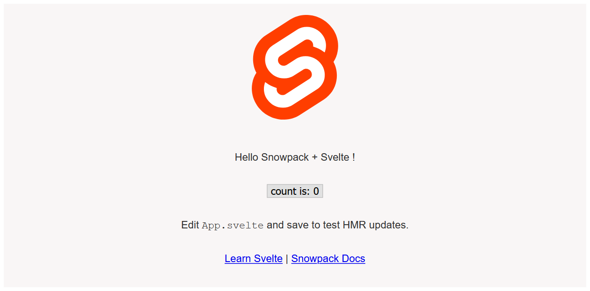

# Snowpack Svelte Template

> ✨ Bootstrapped with Create Snowpack App (CSA).

This is a starter [Snowpack](https://snowpack.dev) template with [Svelte.js](https://svelte.dev).

## Available Scripts

### npm start

Runs the app in the development mode.
Open http://localhost:8080 to view it in the browser.

The page will reload if you make edits.
You will also see any lint errors in the console.

### npm run build

Builds a static copy of your site to the `build/` folder.
Your app is ready to be deployed!

**For the best production performance:** Add a build bundler plugin like [@snowpack/plugin-webpack](https://github.com/snowpackjs/snowpack/tree/main/plugins/plugin-webpack) or [snowpack-plugin-rollup-bundle](https://github.com/ParamagicDev/snowpack-plugin-rollup-bundle) to your `snowpack.config.json` config file.

### npm run format

Formats all files supported by Prettier in the current directory and its subdirectories.

### npm run lint

Check if all files supported by Prettier in the current directory and subdirectories are formatted.

### Q: What about Eject?

No eject needed! Snowpack guarantees zero lock-in, and CSA strives for the same.
